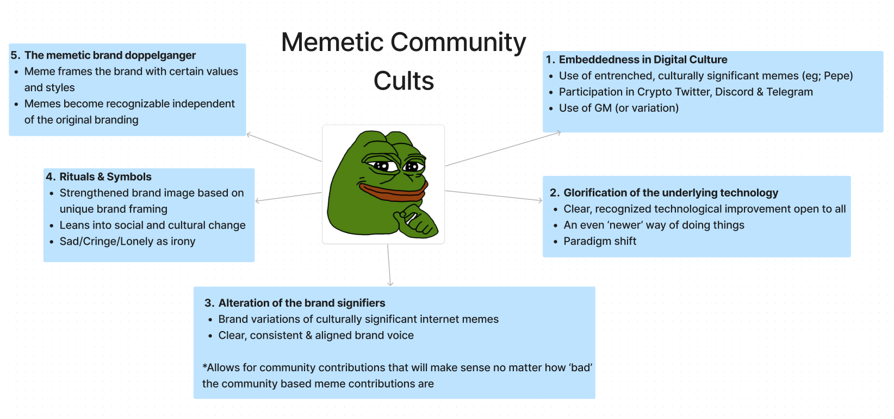

[**Creating a community cult(ure)**] 
How to build, nurture and understand the creation of a community cult(ure) in web3.  
---

Web2 products and communities are largely built on para social relationships. Users expend energy and effort on a product or experience and in return the app (or company) gains your valuable, commodifiable data & attention. This is largely a one way relationship transaction.

The difference in relationship between a web2 and a web3 product is web3’s ability to incentivize mediated social relationships, which are based on give and take rather than a one way transaction.

This web3 user\<\>product relationship is built on continuous participation & intellectual hypothecation, defined as the construction & dissemination of cultural meaning (intellectual work) using brand identity as a medium.

Moving from para social to a mediated social relationship creates a symbiotic environment

; users & participants are renumerated, rewarded and revered via accumulated reputation and acknowledgement within web3 network. The work users do and the rewards products and users receive form the basis of a memetic community cult.

This dynamic has arguably not existed in the online world before. Memetic cults of personality are nothing new. However, web3’s ability to commodify and codify these cults in a network is a genuinely novel & continually evolving paradigm. It is why memetic community cults as a function of successful Web3 companies are so important.

The use and understanding of this new cultural paradigm is under leveraged. The image below is an attempt at parlaying a well understood modern political science theory in a Web3 context; a framework to understand (and build) strong Web3 Communities.

Here’s a break down of each point, with its significance explained and its relevance applied in relation to Web3 communities.

**Embeddedness in Digital Culture.**

* The use of *entrenched, culturally significant memes* in communications across social channels demonstrates a modicum of understanding and familiarity with an established, valued culture. It is a source of legitimacy and understanding; attained purely via use of established semiotics.  
* Meeting your ‘community’ and establishing a presence where users congregate via *participation in Crypto Twitter, Discord and Telegram* signifies a willingness to establish relationships beyond that of the para-social. This signification is essential when establishing and building a community. A community cannot engage or grow without this presence.  
* The *use of GM (or a variation)* is an acknowledgment. Recognition a connectedness beyond the barriers separating them \- it’s an acknowledgment of presence, despite (or in spite) of users’ engagement.  
  
**Glorification of the underlying technology**
  
* A product has to offer a *clear, recognized technological improvement open to all*. This is a cornerstone cultural concept within web3 \- technological benefit and open participation as a public good is essential.  
* Web3 technology at its core is a promise of *even newer ways of doing things*. New user experiences and consumer products are an exciting, alluring prospect.  
* The promise of Web3 is a *paradigm shift.* The reformatting and restructuring of political and economic boundaries; inclusive of everyone willing to participate.  
  
**Alteration of brand signifiers**  

* The creation and use of *branded variations of culturally significant internet memes* demonstrates an innate understanding of the cultural landscape and language. Their creation allows unique & compelling narrative structures to form around brands and communities.  
* Leveraging variations of culturally significant memes clears the way to establishing a *clear, consistent and aligned brand voice* which then serves as a foundation for community to build on.  
  
**Rituals and Symbols**  

* Leveraging the use and adoption of rituals and symbols creates a *strengthened brand image with unique framing.* A brands strength is directly related to the communities diversity and the strength of that communities ideas via various cultural frames.  
* Community diversity requires brands to *lean into social and cultural change.* Failure to do so leads to disenfranchisement and a stagnation of cultural identity.  
* Modernity is a painful, often confusing existence. People who spend large portions of their time online satirize *being sad/cringe/lonely* as an ironic but painful reality. Acknowledgment of this is empowering in a culture that embraces a social and economic paradigm shift.  
  
**The memetic brand doppelganger**  

* Continued and varied use of memes *frames the brand with certain values and styles.* These values and styles form the cultural basis of a communities identity, which constantly evolves new meaning.  
* At a certain point, *memes become recognizable independent of their original branding or meaning*. They carry with them parts of the formational culture, but take on lives of their own.  
  Thanks for reading \- i hope this has in some way illuminated what makes a web3 community. I will (eventually) expand on these ideas to give people a better understanding of how to execute these principles, provide concrete examples of each and techniques people can use to put them to work in their own web3 communities.  
  
Until next time.